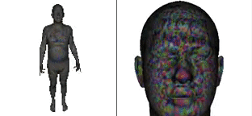
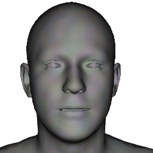
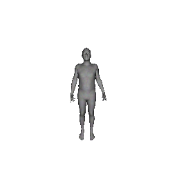
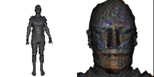

# CLIPMesh-SMPLX

The following is a research project initially inspired by [CLIPMatrix](https://arxiv.org/abs/2109.12922). Following the release of [CLIP-Actor](https://arxiv.org/abs/2206.04382) and [AvatarCLIP](https://hongfz16.github.io/projects/AvatarCLIP.html) I've decided to just release my code since my work was quite similar. The main difference is that this uses meshes which are much faster and less memory-intensive, additionally I explore multiple independent optimizable parameters

## License

This project is for research purposes only

### SMPL-X

This codebase uses SMPL-X Models and the smplx pip library. **By using this code you agree to the [SMPL-X Model License](https://smpl-x.is.tue.mpg.de/modellicense.html) and [smplx License](https://github.com/vchoutas/smplify-x#license)**

### Renderer

This code base relies on [nvdiffmodeling](https://github.com/NVlabs/nvdiffmodeling) and in turn [nvdiffrast](https://nvlabs.github.io/nvdiffrast/#licenses).

## Demos

Get started by testing out the features through the collabs

|||
:--------------------------------------------------:|:--------------------------------------------------:|
| [Create a character from just a text prompt](https://colab.research.google.com/drive/1jtVfsDTkWfOxzrSdjlooJnyhfQKLnslN?usp=sharing)  | [Change an expression with text prompt]() |

|||
:--------------------------------------------------:|:--------------------------------------------------:|
| [Pose with a description (⚠️ WIP)]()             | [Create fantastic creatures like CLIPMatrix]() |

## Setup

```
git clone --recurse-submodules git@github.com:NasirKhalid24/CLIPMesh-SMPLX.git
cd CLIPMesh-SMPLX

# or manually unzip so the .npz files are in the folder as shown below
unzip /models/smplx/smplx_npz.zip -d /models/smplx   

pip install virtualenv
virtualenv ENV
source ENV/bin/activate

pip install --upgrade pip
pip install -r requirements.txt
```


```
CLIPMesh-SMPLX
│
└───models
│   └───smplx
│       │   SMPLX_NEUTRAL.npz
│       │   ....
│       │   ....
``` 

To replicate the demos you can use the configs provided.

```
# For a single character generation
python main.py --path=configs/single.yaml

# For a single expression generation
python main.py --path=configs/expression.yaml

# For a single pose generation
python main.py --path=configs/pose.yaml

# For a CLIPMatrix type generation
python main.py --path=configs/pose.yaml

# For something else use params
python main.py \
--optim   body expression texture normal \
--options face full back \
--epochs  1000 \
--gpu     0 \
--face_text "a thin 3D render of the face of a James Bond" \
--full_text "a thin 3D render of the James Bond" \
--back_text "a thin 3D render of the back of James Bond" \
--debug_log true
--log_int 250
```
